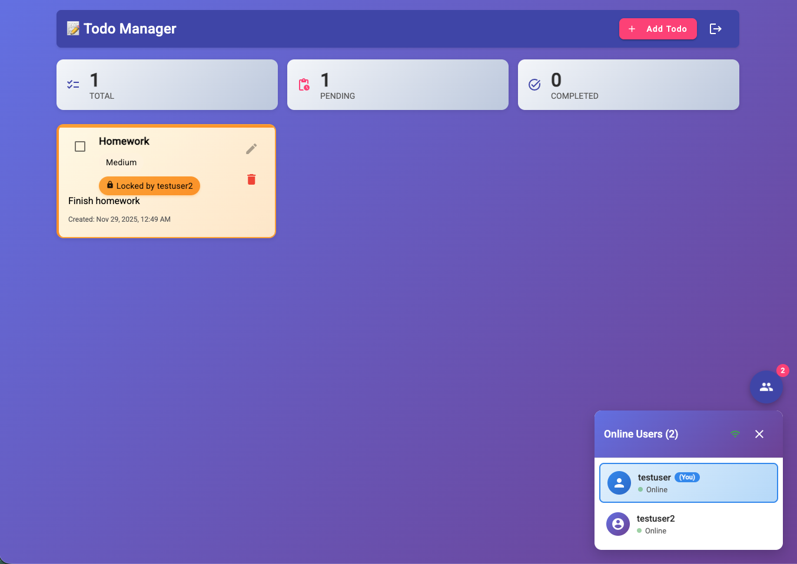

# Real-Time To-Do List Application

A modern, collaborative to-do list application featuring real-time synchronization, user presence tracking, and optimistic locking to prevent editing conflicts. Built with Angular 18 and Node.js with Socket.IO for seamless real-time collaboration.



## Features

- **Real-Time Collaboration**: Live synchronization of todos across all connected users
- **User Presence Tracking**: See who's online with a floating users menu
- **Optimistic Locking**: Prevent editing conflicts with automatic todo locking when editing
- **Visual Lock Indicators**: Clear visual feedback showing which todos are being edited by other users
- **Secure Authentication**: JWT-based auth with HTTP-only cookies (XSS/CSRF protected)
- **Priority Management**: Organize todos by priority levels (low, medium, high)
- **Completion Tracking**: Mark todos as completed with strike-through styling
- **Responsive Design**: Modern Material Design UI that works on all devices
- **In-Memory Fallback**: Works without MongoDB for development and testing

## Technologies Used

### Frontend
- Angular 18 (Standalone Components, Zoneless)
- Angular Material
- Socket.IO Client
- RxJS
- TypeScript

### Backend
- Node.js + Express
- Socket.IO
- MongoDB + Mongoose
- JWT Authentication
- bcrypt
- TypeScript

### Architecture
- Monorepo with npm workspaces
- Shared types package for type safety
- Repository pattern with in-memory fallback
- Class-based services with dependency injection

## Getting Started

### Prerequisites
- Node.js 18+ 
- npm 9+
- MongoDB (optional - will use in-memory storage if not available)

### Installation

1. Clone the repository:
```bash
git clone https://github.com/LeonYalin/cityshob-home-assignment.git
cd cityshob-home-assignment
```

2. Install dependencies:
```bash
npm install
```

3. (Optional) Set up MongoDB:
```bash
cp packages/backend/.env.example packages/backend/.env
# Edit .env and set MONGODB_URI
```

### Running the Application

Start both frontend and backend:
```bash
npm run start:dev
```

The application will be available at:
- **Frontend**: http://localhost:4200
- **Backend API**: http://localhost:4000
- **Health Check**: http://localhost:4000/api/health

## Additional Commands

**Backend only**:
```bash
npm run dev:backend
```

**Frontend only**:
```bash
npm run dev:frontend
```

**Build for production**:
```bash
npm run build
```

**Run tests**:
```bash
npm run test
```

**Lint code**:
```bash
npm run lint
```

## Project Structure

```
cityshob-home-assignment/
├── packages/
│   ├── backend/           # Node.js API server
│   │   ├── src/
│   │   │   ├── controllers/    # HTTP request handlers
│   │   │   ├── services/       # Business logic
│   │   │   ├── repositories/   # Data access layer
│   │   │   ├── socket/         # WebSocket handlers
│   │   │   ├── models/         # MongoDB schemas
│   │   │   └── middleware/     # Auth & validation
│   │   └── package.json
│   ├── frontend/          # Angular 18 application
│   │   ├── src/
│   │   │   ├── app/
│   │   │   │   ├── components/ # UI components
│   │   │   │   ├── services/   # API & WebSocket
│   │   │   │   ├── guards/     # Route protection
│   │   │   │   └── interceptors/ # HTTP interceptors
│   │   └── package.json
│   └── common/            # Shared types and constants
│       ├── src/
│       │   ├── types/          # TypeScript interfaces
│       │   └── constants/      # Socket event constants
│       └── package.json
└── package.json           # Root workspace
```

## Implementation Highlights

### Real-Time Features
- **Socket.IO Integration**: Bi-directional communication for instant updates
- **User Presence**: Track online users with connection/disconnection events
- **Todo Locking**: Automatic locking mechanism prevents simultaneous edits
- **Broadcast Events**: All CRUD operations broadcast to connected clients

### Security
- **HTTP-Only Cookies**: JWT tokens stored securely, inaccessible to JavaScript
- **SameSite Policy**: CSRF protection with cookie configuration
- **bcrypt Hashing**: Secure password storage
- **Auth Middleware**: Protected API endpoints
- **Route Guards**: Frontend route protection

### Code Quality
- **TypeScript**: Full type safety across frontend and backend
- **Shared Types**: Common package eliminates code duplication
- **Repository Pattern**: Clean separation of data access
- **Dependency Injection**: Testable, maintainable code structure
- **Comprehensive Tests**: 215+ tests with Jest

## License

This project is licensed under the MIT License.

---

**Author**: Leon Yalin  
**Repository**: [cityshob-home-assignment](https://github.com/LeonYalin/cityshob-home-assignment)
